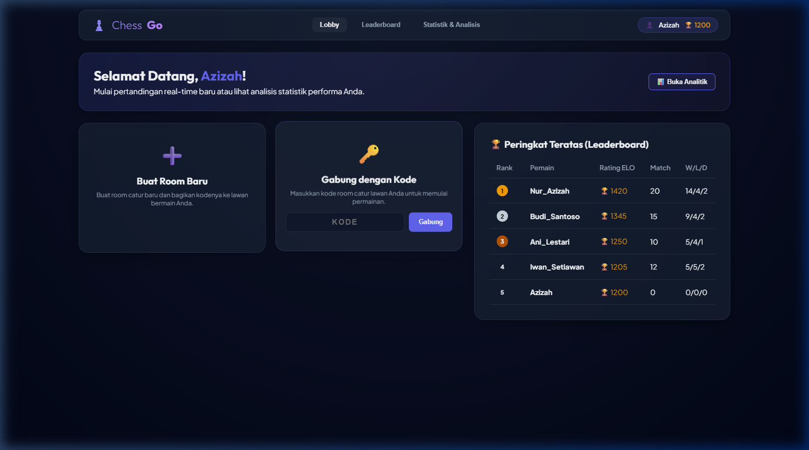
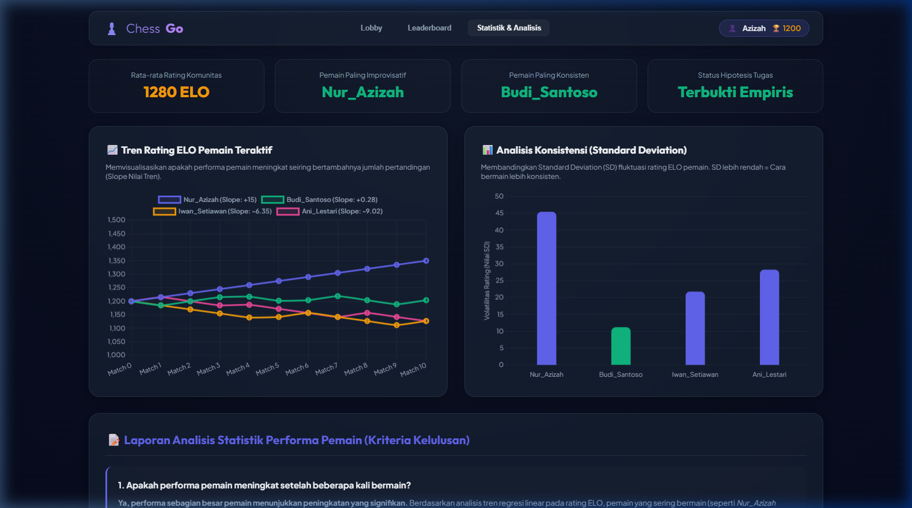
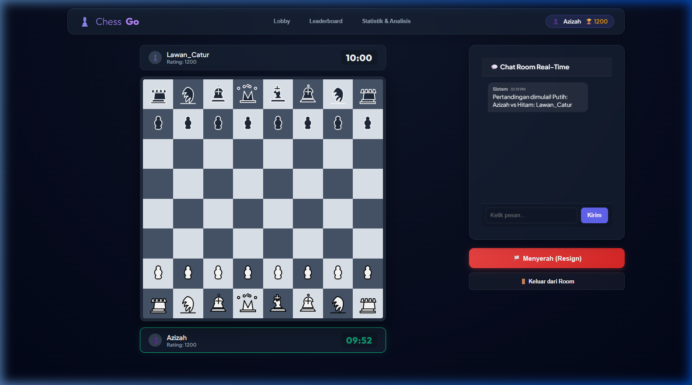

# ♟️ Chess Go - Proyek Akhir Cloud Computing

Aplikasi Game Catur Online Multi-Pemain Real-Time berbasis WebSocket dengan perhitungan rating ELO otomatis dan visualisasi dashboard analisis statistik performa pemain.

---

## 👥 Anggota Kelompok & Peran
| Nama Mahasiswa | NPM | Peran |
| :--- | :--- | :--- |
| **Azizah** | 2410010343 | Fullstack Developer (Backend / Frontend / Database / Statistik) |

---

## 🔗 Link Penting
* [Proposal Proyek Akhir (Markdown)](./proposal_draft.md) *(Ekspor ke PDF secara manual untuk berkas resmi)*
* [Laporan Akhir Proyek (Markdown)](./laporan_akhir_draft.md) *(Ekspor ke PDF secara manual untuk berkas resmi)*
* [Slide Presentasi PDF](./Slide_Presentasi.pdf) *(Bisa diisi manual oleh Anda)*
* [Video Demo Aplikasi YouTube](https://youtu.be/link_video_demo_anda) *(Bisa diisi manual oleh Anda, durasi wajib 10-15 menit)*

---

## 🛠️ Teknologi yang Digunakan
- **Frontend**: HTML5, Vanilla CSS3 (Glassmorphism & Neon Glow Dark Mode), Vanilla JavaScript, Chart.js (via CDN).
- **Backend**: Node.js & Express API.
- **WebSocket Protocol**: Socket.io untuk sinkronisasi pergerakan bidak & clock real-time.
- **Catur Engine**: Chess.js (Server-side & Client-side validation).
- **Database**:
  - **MySQL (Default)**: Didukung penuh dengan driver `mysql2` (Skema: [schema.sql](./database/schema.sql)).
  - **SQLite (Fallback)**: Terintegrasi otomatis. Jika koneksi MySQL tidak dikonfigurasi, sistem akan beralih memakai SQLite lokal (`database.db`) secara otomatis demi kemudahan testing instan oleh dosen.

---

## 📸 Screenshot Sistem
Berikut adalah tangkapan layar sistem yang menunjukkan fitur-fitur utama aplikasi:

### 1. Lobby & Leaderboard
Menampilkan halaman utama untuk membuat room baru, bergabung menggunakan kode room unik, serta tabel peringkat teratas (Leaderboard global).


### 2. Statistik & Analisis Performa
Grafik analitik tren rating ELO pemain teraktif dan diagram batang stabilitas konsistensi bermain (Standard Deviation) untuk menjawab kriteria wajib dosen.


### 3. Game Room (Pertandingan Catur Real-Time)
Tampilan arena tanding catur real-time tersinkronisasi, lengkap dengan panel clock timer untuk masing-masing pemain dan sistem chat room WebSocket.


---

## ⚙️ Cara Menjalankan Sistem

### 1. Prasyarat (Prerequisites)
Pastikan Anda sudah menginstal **Node.js** (versi >= 16.0.0) di komputer Anda.

### 2. Instalasi Dependensi
Jalankan perintah berikut di terminal pada direktori proyek Anda:
```bash
npm install
```

### 3. Konfigurasi Database (Opsional)
Secara default, aplikasi akan berjalan menggunakan database **SQLite lokal** (`database.db`) secara otomatis.

Jika Anda ingin menghubungkannya ke **MySQL Server** asli:
1. Buat database kosong bernama `chess_db` di server MySQL Anda.
2. Impor file skema database [schema.sql](./database/schema.sql).
3. Buat file `.env` di direktori akar proyek dan tambahkan konfigurasi berikut:
   ```env
   DB_HOST=localhost
   DB_USER=root
   DB_PASSWORD=password_mysql_anda
   DB_NAME=chess_db
   DB_PORT=3306
   ```

### 4. Menjalankan Aplikasi
Mulai server web local dengan perintah berikut:
```bash
npm start
```
Buka browser Anda dan akses tautan **[http://localhost:3030](http://localhost:3030)**.

*Tips Pengujian*: Buka dua jendela browser terpisah (atau gunakan satu mode Samaran/Incognito) untuk mensimulasikan dua pemain yang bertanding secara real-time.
